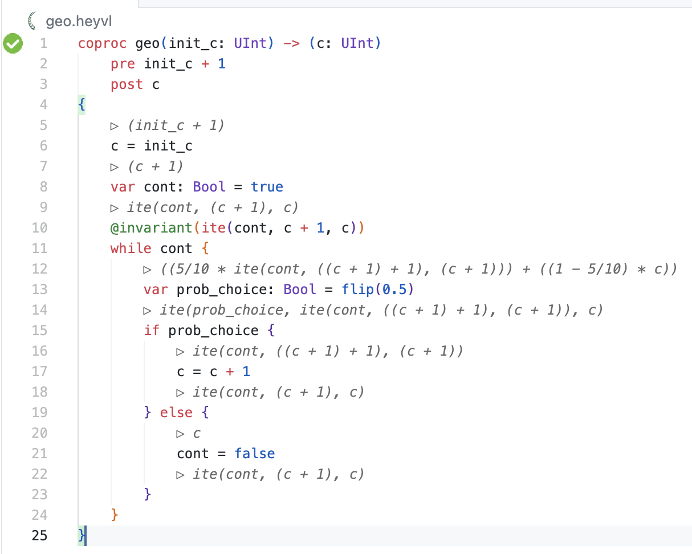

# The Deductive Verifier *Caesar* for VSCode

This is the VSCode extension for the [Caesar deductive verifier](https://www.caesarverifier.org).
Caesar is a verifier for probabilistic and quantitative programs and thus supports reasoning about quantitative specifications such as "the expected runtime is at most `2x`".
Caesar uses the *HeyVL* language as its quantitative *intermediate verification language* (IVL).
This VSCode extension recognizes the `.heyvl` file extension.

You can find more information about Caesar and HeyVL on the website: https://www.caesarverifier.org/.

On the website, you can also download the Caesar command-line binary for more advanced use cases that are not included in this VSCode extension.

## Features

 * Syntax highlighting and language configuration for HeyVL.
 * Snippets for HeyVL.
 * Verify HeyVL files on file save or on command.
 * Verification errors and successes are shown in the gutter via icons.
 * Diagnostics such as errors or warnings are shown in the code and in the "Problems" menu in VSCode.
 * Inline explanations of computed verification conditions.
 * Automatic installation and updating of Caesar.

## Requirements

You will need to provide the Caesar binary for the extension to run.
See [installation instructions](https://www.caesarverifier.org/docs/getting-started/installation) for more information.

We provide binaries for MacOS (ARM and x86-64), Windows (x86-64), and Debian/Linux (x86-64).

## Extension Settings

You can find Caesar's settings in the settings menu in the "Caesar" section.

## Known Issues

This is a very new VSCode extension for Caesar.
If you encounter any issues, [feel free to open an issue](https://github.com/moves-rwth/caesar/issues).

## Release Notes

On Github, we have a list of all of [Caesar's releases](https://github.com/moves-rwth/caesar/releases) along with binaries.
