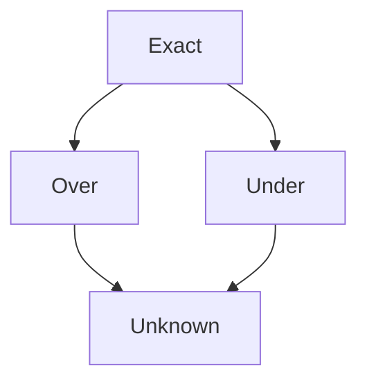

```mdx-code-block
import Link from '@docusaurus/Link';
```

As mentioned [before](https://www.caesarverifier.org/docs/heyvl/statements#semantics), HeyVL statements are interpreted via the (quantitative) verification condition semantics (vc), which are similar to other calculi such as wp, wlp, and ert. For such calculi, exactly computing the pre-expectation of a loop requires computing a least or greatest fixed point, which is infeasible in general. Instead, we use [proof rules](./README.md) to *approximate* the actual pre-expectation. In addition, other statements such as [negations](../heyvl/statements#negations) can also cause approximations.

Caesar keeps track of these approximations and derives soundness diagnostics based on them. This means that Caesar can indicate that a verification result might be unsound. There are four possible approximation kinds: _Over_, _Under_, _Exact_, and _Unknown_.

- **Exact** means no approximation is performed.
- **Under** means the pre-expectation is approximated from below.
- **Over** means the pre-expectation is approximated from above.
- **Unknown** means it is not known whether the approximation is an over- or under-approximation.

Formally, let $\text{calculus}[S](X)$ be the pre-expectation of a statement $S$ with post-expectation $X$ in some pre-expectation calculus, and let $\text{vc}[S](X)$ be the verification condition semantics of $S$ with post-expectation $X$. The approximations are defined as follows:

- **Exact**: $\text{calculus}[S](X) = \text{vc}[S](X)$ for all $X$
- **Under**: $\text{calculus}[S](X) \geq \text{vc}[S](X)$ for all $X$
- **Over**: $\text{vc}[S](X) \geq \text{calculus}[S](X)$ for all $X$
- **Unknown**: none of the above holds

Every HeyVL statement can be assigned one of these approximations based on information about the scope in which the statement appears (e.g., whether it is in a `proc` or a `coproc`, and which [calculus annotation](./calculi) is used).

Currently, every statement except proof-rule-annotated loops and negations is assigned the **Exact** approximation. Of these two exceptions, **negations always yield an Unknown approximation**, whereas proof-rule-annotated loops can yield all four approximations depending on the proof rule used. We discuss these cases in more detail below.

It is also possible to order these approximation types using a partial order. This is useful when combining approximations from multiple statements. The following diagram shows this ordering:



As can be seen, this ordering forms a lattice with **Exact** as the most precise approximation and **Unknown** as the least precise one.

For a block of statements, the approximation is computed by combining the approximations of the individual statements in the block. When combining approximations, Caesar uses the least upper bound (join) operation of this lattice.

For example, if one statement in a block yields an **Over** approximation and another yields an **Exact** approximation, the combined approximation for the block is **Over**. Intuitively, if one statement in a block yields an **Over** approximation, the entire block cannot be more precise than that. Similarly, if one statement yields an **Under** approximation and another yields an **Exact** approximation, the combined approximation for the block is **Under**. If there are multiple statements with **Over** and **Under** approximations, the combined approximation is **Unknown**.

In the following sections, we explain how proof rules yield different approximations depending on the fixed point semantics used for loops.

## Fixed Point Semantics

How a proof rule approximates the original program semantics depends on the fixed point semantics used for loops (least or greatest). Each calculus (`wp`, `wlp`, `ert`) uses either least or greatest fixed point semantics for loops. The following table summarizes this:

| Calculus | Fixed Point Semantics for Loops |
| -------- | ------------------------------- |
| `@wp`    | Least Fixed Point               |
| `@wlp`   | Greatest Fixed Point            |
| `@ert`   | Least Fixed Point               |

Therefore, if a `proc` or `coproc` is annotated with a calculus (`@wp`, `@wlp`, or `@ert`), the fixed point semantics are determined according to the table above. Calculus annotations are optional; if no annotation is present, Caesar assumes default fixed point semantics based on whether the construct is a `proc` or a `coproc`. The following table summarizes these defaults:

| Procedure Kind | Default Fixed Point Semantics for Loops |
| -------------- | --------------------------------------- |
| `proc`         | Least Fixed Point                       |
| `coproc`       | Greatest Fixed Point                    |

Some proof rules are only sound for certain fixed point semantics. Additionally, some proof rules have variants and therefore yield different approximations depending on the fixed point semantics.

## Proof Rule Approximations

Each proof rule yields different approximations depending on the fixed point semantics used for loops. Additionally, the approximation of the loop body also affects the overall approximation of the loop statement.

The following table summarizes which proof rules yield which approximations depending on the fixed point semantics used for loops, **assuming the loop body has an Exact approximation**.

<table>
    <thead>
        <tr>
            <td>Proof Rule</td>
            <td>Approximation for LFP (`@wp`, `@ert`, or `proc` without annotation)</td>
            <td>Approximation for GFP (`@wlp` or `coproc` without annotation)</td>
        </tr>
    </thead>
    <tbody>
        <tr>
            <td><Link to="./induction">(k)-Induction</Link></td>
            <td>Overapproximation</td>
            <td>Underapproximation</td>
        </tr>
        <tr>
            <td><Link to="./unrolling">Loop Unrolling</Link></td>
            <td>Underapproximation</td>
            <td>Overapproximation</td>
        </tr>
        <tr>
            <td><Link to="./omega-invariants">ω-invariants</Link></td>
            <td>Underapproximation</td>
            <td>Overapproximation</td>
        </tr>
        <tr>
            <td><Link to="./ast">Almost-Sure Termination Rule</Link></td>
            <td>Exact</td>
            <td>Unknown</td>
        </tr>
        <tr>
            <td><Link to="./past">Positive Almost-Sure Termination Rule</Link></td>
            <td>Exact</td>
            <td>Unknown</td>
        </tr>
        <tr>
            <td><Link to="./ost">Optional Stopping Theorem</Link></td>
            <td>Exact</td>
            <td>Unknown</td>
        </tr>
    </tbody>
</table>

For the following proof rules, the approximation of the loop body is directly combined with the default approximation yielded by the proof rule according to the table above:
- <Link to="./induction">(k)-Induction</Link>
- <Link to="./unrolling">Loop Unrolling</Link>
- <Link to="./omega-invariants">ω-invariants</Link>

For example, consider the following code:

```heyvl
@wp proc example() -> () {
    @invariant(...)
    while (...) {
        // loop body with Under approximation
    }
}
```

Here, the loop uses the (k)-Induction proof rule with the `@wp` calculus annotation. According to the table above, (k)-Induction with LFP semantics yields an **Over** approximation. However, since the loop body has an **Under** approximation, the overall approximation for the loop is computed by combining **Over** and **Under**, which results in an **Unknown** approximation.

The following proof rules assume that you do not approximate within your `while` loops, but instead encode the *exact* `wp`/`ert` semantics of your program:
- <Link to="./ast">Almost-Sure Termination Rule</Link>
- <Link to="./past">Positive Almost-Sure Termination Rule</Link>
- <Link to="./ost">Optional Stopping Theorem</Link>

This is because these proof rules implicitly perform both lower- and upper-bound checks on the loop body and therefore require the exact loop body semantics. Consequently, if the loop body does not have an **Exact** approximation, the overall approximation for the loop is set to **Unknown**.

# Soundness

Caesar uses these approximations to derive soundness diagnostics for verification results. An important use case for these diagnostics is when you want to *refute* a lower or upper bound instead of verifying it. In other words, the user can intentionally use Caesar to show that a certain expectation is **not** a lower or upper bound. If such a refutation is unsound, Caesar will indicate this via soundness diagnostics. Similarly, if the user wants to verify a lower or upper bound but the verification is unsound, Caesar will also indicate this.

We now explain when a verification or refutation is sound or unsound based on the approximations derived above. This is based on a simple transitivity argument.

## Sound and Unsound Verifications

Consider the following HeyVL procedure:

```heyvl
@wp proc example() -> ()
    pre L // some lower-bound expectation
    post X
{
    S;  // some statement
}
```

Note that this is a `proc` annotated with the `@wp` calculus. Therefore, the goal of the verification is to prove that $L \leq wp[S](X)$, where $wp[S](X)$ is the pre-expectation of statement $S$ with post-expectation $X$ in the `@wp` calculus (i.e., the weakest pre-expectation). However, as explained above, Caesar might not compute the exact weakest pre-expectation $wp[S](X)$, but instead computes an approximation $vc[S](X)$ based on the derived approximations. Therefore, what Caesar actually verifies is $L \leq vc[S](X)$. This is exactly the verification condition semantics of statement $S$ with post-expectation $X$.

If $vc[S](X)$ is an **Under** approximation of $wp[S](X)$, i.e., $vc[S](X) \leq wp[S](X)$, then we have:
$$
L \leq vc[S](X) \leq wp[S](X).
$$
By transitivity of $\leq$, it follows that $L \leq wp[S](X)$, and thus the verification is sound.

If instead $vc[S](X)$ is an **Over** approximation of $wp[S](X)$, i.e., $wp[S](X) \leq vc[S](X)$, then we cannot derive any relation between $L$ and $wp[S](X)$ from $L \leq vc[S](X)$ and $vc[S](X) \geq wp[S](X)$. Therefore, in this case, the verification might be unsound.

To summarize:

<table>
    <thead>
        <tr>
            <td>Procedure Kind</td>
            <td>Exact</td>
            <td>Over</td>
            <td>Under</td>
            <td>Unknown</td>
        </tr>
    </thead>
    <tbody>
        <tr>
            <td>`proc`</td>
            <td>Sound</td>
            <td>Unsound</td>
            <td>Sound</td>
            <td>Unsound</td>
        </tr>
        <tr>
            <td>`coproc`</td>
            <td>Sound</td>
            <td>Sound</td>
            <td>Unsound</td>
            <td>Unsound</td>
        </tr>
    </tbody>
</table>

In the case of an *unsound* verification, Caesar reports this as a diagnostic in the verification result.

## Sound and Unsound Refutations

We now consider the same HeyVL procedure as above, but assume that the user wants to refute the lower bound $L$. Suppose the verification fails, i.e., Caesar shows that $L \nleq vc[S](X)$.

If $vc[S](X)$ is an **Over** approximation of $wp[S](X)$, i.e., $wp[S](X) \leq vc[S](X)$, then $L$ cannot be a lower bound of $wp[S](X)$. Otherwise, we would have:
$$
L \leq wp[S](X) \leq vc[S](X),
$$
which contradicts the assumption that $L \nleq vc[S](X)$. Therefore, it follows that $L \nleq wp[S](X)$, and hence the refutation is sound.

If instead $vc[S](X)$ is an **Under** approximation of $wp[S](X)$, i.e., $vc[S](X) \leq wp[S](X)$, then we cannot derive any relation between $L$ and $wp[S](X)$ from $L \nleq vc[S](X)$ and $vc[S](X) \leq wp[S](X)$, because $L$ might still lie between $vc[S](X)$ and $wp[S](X)$. Therefore, in this case, the refutation might be unsound.

To summarize:

<table>
    <thead>
        <tr>
            <td>Procedure Kind</td>
            <td>Exact</td>
            <td>Over</td>
            <td>Under</td>
            <td>Unknown</td>
        </tr>
    </thead>
    <tbody>
        <tr>
            <td>`proc`</td>
            <td>Sound</td>
            <td>Sound</td>
            <td>Unsound</td>
            <td>Unsound</td>
        </tr>
        <tr>
            <td>`coproc`</td>
            <td>Sound</td>
            <td>Unsound</td>
            <td>Sound</td>
            <td>Unsound</td>
        </tr>
    </tbody>
</table>

In the case of an *unsound* refutation (counterexample), Caesar will indicate that this counterexample might not apply to the original program.

## Example

Ultimately, whether a verification result or counterexample is sound or unsound depends on multiple factors explained above: the procedure kind, the calculus annotation, the proof rules used, and the approximations of the loop bodies.

We now illustrate how these factors come together with an example. Consider the following HeyVL procedure:

```heyvl
@wp proc am_i_sound() -> ()
pre ...
post ...
{
    @invariant(...)
    while (...) {
        ... // loop body with Exact approximation
    }
}
```

We explain step by step whether a verification of a lower bound in this procedure is sound or unsound.

First we notice that there is a calculus annotation here, which means the procedure kind (`proc`) does not determine the fixed point semantics. Instead, the `@wp` annotation indicates that the loop uses least fixed point semantics. 

Next, we look at the proof rule used for the loop. The loop uses the <Link to="./induction">Induction</Link> proof rule, which according to the table above yields an **Over** approximation for least fixed point semantics. Combining **Over** (from the proof rule) and **Exact** (from the loop body) yields an overall **Over** approximation for the loop.

Finally, we look at the procedure kind, which is a `proc`. According to the soundness table for verifications, a `proc` with an **Over** approximation yields an *unsound* verification. Therefore, if Caesar verifies a lower bound in this procedure, it will indicate that the verification might be unsound. 

Let's instead assume that Caesar refutes the lower bound in this procedure, i.e., the verification fails. According to the soundness table for refutations, a `proc` with an **Over** approximation yields a *sound* refutation.

If we change the calculus annotation from `@wp` to `@wlp`, the fixed point semantics change from least to greatest. Therefore the procedure now becomes sound for verifications and unsound for refutations.
