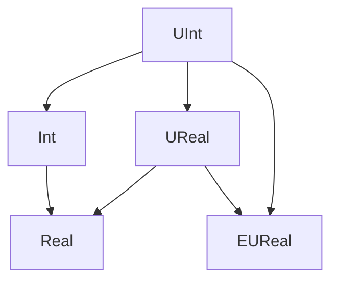

# Number Types

Caesar supports a variety of unbounded numerical types.

The [expressions documentiation](../heyvl/expressions.md) has a list of Caesar's numerical operators.
The following diagram illustrates the hierarchy of numeric types supported by Caesar.

An arrow from a type to another type indicates that it is a _subtype_ and that a value can be converted into the supertype.
This is done automatically by Caesar when appropriate.

## Mathematical Number Types

Caesar supports various number types that are not restricted by a finite bit size.
Therefore, all of these types have infinitely many values.

### UInt

Unsigned integers, i.e. values `0`, `1`, `2`, and so on.

<small>This type was previously called `Uint`. For the moment, Caesar also accepts this name.</small>

### Int

Signed integers.

### UReal

Unsigned real numbers, i.e. values x ∈ ℝ such that x ≥ 0.

This is the type of fraction expressions `a/b` where `a` and `b` are unsigned integer literals, as well as decimals such as `3.14`.

### Real

Actual real numbers!

### EUReal

Extended unsigned real numbers.
This type includes all values from the `UReal` type and also allows the value `∞`.

This type admits a Heyting algebra and can be used as a verification domain.

<small>This type was previously called <code>Realplus</code>. For the moment, Caesar also accepts this name.</small>
